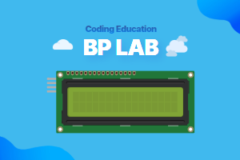

# LCD Extension for MakeCode



This extension allows you to control an I2C LCD1602 display with the micro:bit.

## Use as Extension

This repository can be added as an **extension** in MakeCode.

- open [https://makecode.microbit.org/](https://makecode.microbit.org/)
- click on **New Project**
- click on **Extensions** under the gearwheel menu
- search for **[bplab-dev/pxt-bplab-lcd]** and import

## 🚀 Features

- Easily control I2C LCD1602 display from microcontroller
- Can display numbers, strings using MakeCode blocks
- Also supports LCD backlight and screen pan function
- Can be registered as a MakeCode extension for easy use
- Support for Korean

## Blocks

### 🔍 Summary: What each block does

| **Block ID**                                  | **Function**                                      |
|----------------------------------------------|--------------------------------------------------|
| [`I2C_LCD1620_SET_ADDRESS`](#1-lcd-initialization-block) | Initialize LCD and set I2C address              |
| [`I2C_LCD1620_SHOW_NUMBER`](#2-number-display-block)     | Show a number in a specific location            |
| [`I2C_LCD1620_SHOW_STRING`](#3-string-display-block)     | Show a string at a specific location            |
| [`I2C_LCD1620_ON`](#4-lcd-onoff-block)                 | Switch on the LCD screen                        |
| [`I2C_LCD1620_OFF`](#4-lcd-onoff-block)                | Switch off the LCD screen                       |
| [`I2C_LCD1620_CLEAR`](#5-screen-clear-block)           | Clear the screen                                |
| [`I2C_LCD1620_BACKLIGHT_ON`](#6-backlight-onoff-block)  | Turn on the backlight                           |
| [`I2C_LCD1620_BACKLIGHT_OFF`](#6-backlight-onoff-block) | Turn off the backlight                          |
| [`I2C_LCD1620_SHL`](#7-screen-shift-block)             | Shift screen to the left                        |
| [`I2C_LCD1620_SHR`](#7-screen-shift-block)             | Shift screen to the right                       |

### 1. LCD Initialization Block

- 🔹 Description

  - Initializes the LCD and sets the I2C address.
  - If Addr == 0, it will automatically seek the I2C address.
  - Sets to 4-bit mode and performs basic LCD setup.

- 🔹 Internal behavior

  - Call AutoAddr() to auto-detect I2C address (or use entered address)
  - Set 4-bit mode (cmd(0x33), cmd(0x28))
  - Enable backlight (BK = 8)
  - Clear screen (cmd(0x01))
  - Set Cursor Movement Mode (cmd(0x06))
  - Enable LCD (cmd(0x0C))

- ✅ Usage examples

  ```blocks
  lcd.lcdInit(lcd.I2CLCDAddress.PCF8574)
  ```

  ```blocks
  lcd.lcdInit(lcd.I2CLCDAddress.AutoDetect)
  ```

### 2. Number display block

- 🔹 Description

  - This block outputs a number at a specific position (x, y).
  - It calls ShowString() after converting the number to a string.

- ✅ Usage example

  ```blocks
  lcd.showNumber(123, 0, 0)
  ```

### 3. String display block

- 🔹 Description

  - Displays a string at a specific position (x, y).

- 🔹 Internal behavior

  - cmd(a) → set cursor position (0x80 + x or 0xC0 + x)
  - dat(s.charCodeAt(i)) → Send character to LCD one by one

- ✅ Usage example

  ```blocks
  lcd.showString('Hello', 0, 0)
  lcd.showString('World', 5, 1)
  ```

### 4. LCD ON/OFF block

- 🔹 Description

  - on() → command to switch on the LCD screen (cmd(0x0C))
  - off() → Command to switch off the LCD screen (cmd(0x08))

- ✅ Usage example

  ```blocks
  lcd.on()
  lcd.off()
  ```

### 5. Screen clear block

- 🔹 Description

  - Initializes the LCD screen by sending the cmd(0x01) command.
  - Move the cursor to the (0,0) position.

- ✅ Usage example

  ```blocks
  lcd.clear()
  ```

### 6. Backlight ON/OFF block

- 🔹 Description

  - BacklightOn() → LCD backlight on (BK = 8)
  - BacklightOff() → turn off LCD backlight (BK = 0)

- ✅ Usage example

  ```blocks
  lcd.backlightOn()
  lcd.backlightOff()
  ```

### 7. Screen Shift block

- 🔹 Description

  - shl() → Shift LCD screen left (cmd(0x18))
  - shr() → Shift the LCD screen to the right (cmd(0x1C))

- ✅ Usage example

  ```blocks
  lcd.shl()
  lcd.shr()
  ```

## 📜 License

MIT License

## 💡 About BPLab

BPLab is a specialized company that provides coding education that anyone can easily learn. We provide in-person and online coding education for children, teens, adults, institutions, organizations, small groups, and schools in Korea in various fields such as IoT, artificial intelligence, micro:bit and Arduino.

We are also leading the way in developing and distributing coding education kits that allow learners to build, program, and experience the principles of coding. These kits utilize microcontrollers such as Arduino and micro:bit, as well as various sensors. This micro:bit extension is available for use in courses taught by BPLab.

Visit our websites:

- Korea: [https://bplab.kr](https://bplab.kr)
- Global: [https://bplab-us.com](https://bplab-us.com)
- Japan: [https://bplab-jp.com](https://bplab-jp.com)

## 📍 Metadata (used for search, rendering)

- for PXT/microbit

<script src="https://makecode.com/gh-pages-embed.js"></script><script>makeCodeRender("{{ site.makecode.home_url }}", "{{ site.github.owner_name }}/{{ site.github.repository_name }}");</script>
